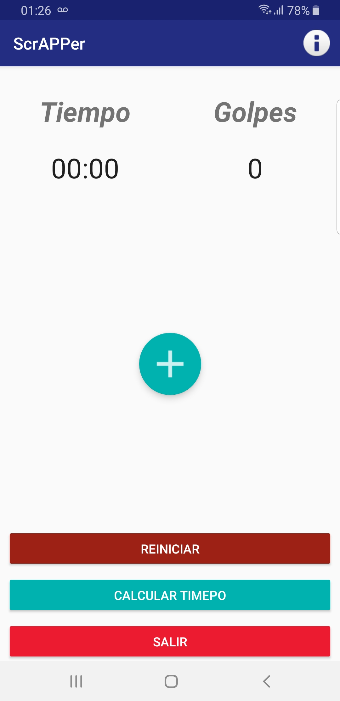
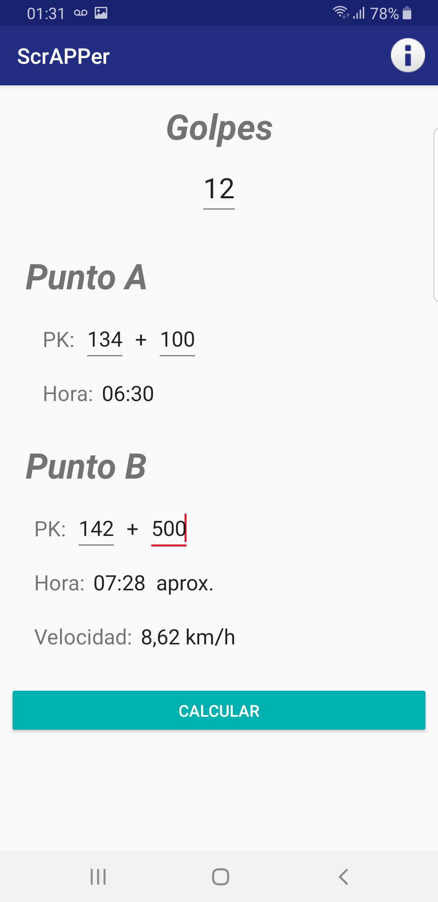
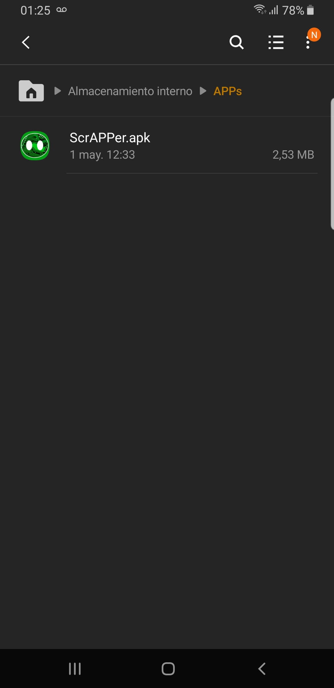
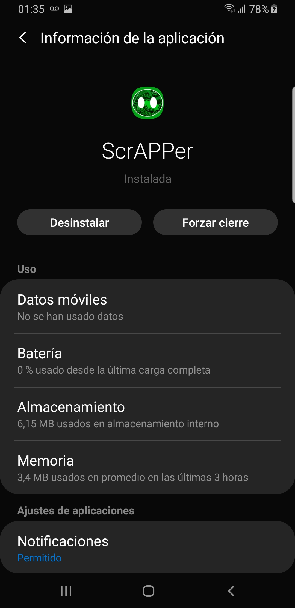

# ScrAPPer - Scraper traking application

This project is a scraper traking application for a gas transportation company. It allows you to track scraper equipment counting the "beats" heard, estimate the time of arrival of the equipment at a specific point and see its speed of movement in a pipe.

## Table of contents

- [Overview](#overview)
  - [The features](#the-features)
  - [Screenshot](#screenshot)
- [The process](#the-process)
  - [Built with](#built-with)
- [Author](#author)

## Overview

### The features

- Optimal layout for the app depending on the device's screen size
- Count the "beats" heard
- Calculate the time of arrival of the equipment at a specific point
- See the speed of movement in a pipe of the equipment
- Modify the "beats", point of origin and destiny to estimate another routes
- Developed for Android devices

### Screenshot

Counter of "beats":

.jpg)

Calculator of time and routes:

Info:

## The process

### Built with

- [Justinmind](https://www.justinmind.com/) - For the prototype
- [Java](https://www.java.com/es/) - For development
- [Android Studio](https://developer.android.com/) - IDE

## Author

- LinkedIn - [Daniel Omar Frias](https://ar.linkedin.com/in/daniel-omar-frias)
